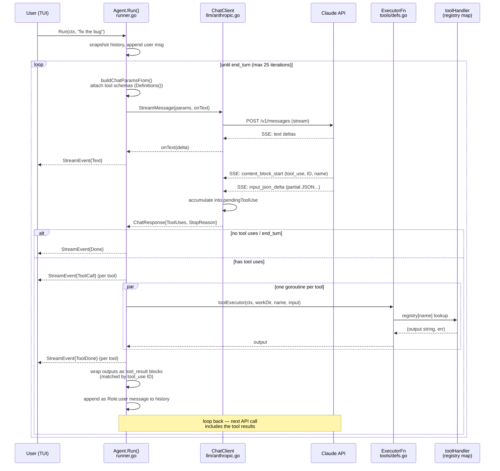

# Tool Calling

How AQL advertises tools to the model, decodes tool calls from the stream,
dispatches them, and feeds results back.

## Key insight

The model does **not** embed magic codes in its text. The Anthropic API
returns structured `tool_use` content blocks alongside text — typed JSON
blocks with an ID, a tool name, and JSON input. Dispatch is a map lookup by
name; results go back as `tool_result` blocks matched by ID.

## Sequence



## The four stages, with source locations

### 1. Advertising tools to the model

`buildChatParamsFrom()` (`internal/agent/runner.go`) attaches
`tools.Definitions()` — name, description, and JSON input schema per tool —
to every API request. This is how the model knows what it can call and what
arguments each tool takes.

### 2. Decoding tool calls from the stream

`consumeStream()` (`internal/llm/anthropic.go`) reads typed SSE events:

- `content_block_start` with `type: "tool_use"` opens a tool call, carrying
  its ID and name.
- `input_json_delta` events deliver the input JSON in chunks; they are
  accumulated into `pendingToolUse.inputBuf`.
- Text deltas stream to the TUI via `onText`; completed tool calls collect
  into `ChatResponse.ToolUses`.

### 3. Dispatch — the lookup table

`buildRegistry()` (`internal/agent/tools/defs.go`) is the
name → handler map:

```go
return map[string]toolHandler{
    "read_file": withDir(execReadFile),
    "bash":      execBash,
    ...
}
```

Every handler has the uniform signature
`func(ctx, workDir string, input json.RawMessage) (string, error)`.
Stateful tools (`task_*`, `agent`) are added by `register*Tools()` inside
`NewExecutor()`. `execute()` does a plain map lookup by the name the model
sent; unknown names return a Go error (infrastructure failure). Tool-level
failures are returned as the string value — see architecture rule 4.

### 4. Feeding results back

The tool loop in `Run()` (`internal/agent/runner.go`):

1. If `resp.ToolUses` is non-empty, `executeTools()` runs all calls in
   parallel goroutines (`runToolsParallel`).
2. `emitToolResults()` wraps each output as a `tool_result` content block
   keyed by the originating `tool_use` ID:
   `domain.ToolResultContentBlock(tu.ID, r.output, r.isError)`.
3. The blocks become a new message with `Role: user` — the API convention
   for returning tool results — appended to local history.
4. The loop calls the API again. The model reads the results and either
   calls more tools or answers with text. `end_turn` or zero tool uses
   exits; `maxToolIterations` (25) is the safety cap.

## Related

- `doc/architecture/overview.md` — package structure and event flow
- `.claude/rules/architecture.md` rules 4 (tool error convention) and 9
  (three-part tool registration)
